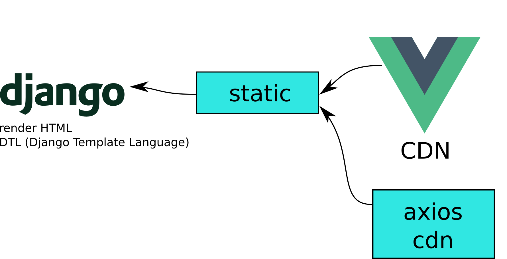
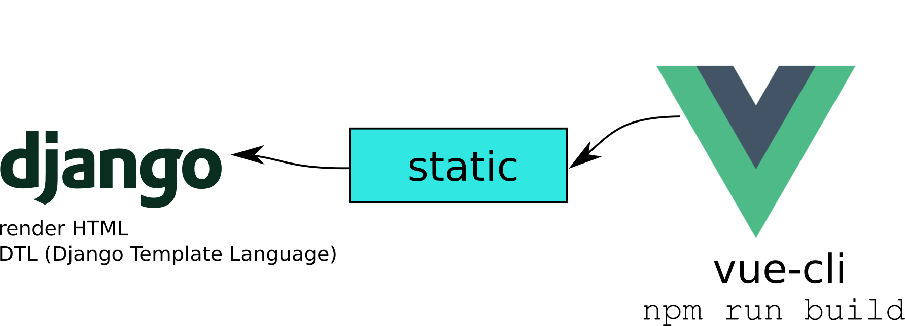
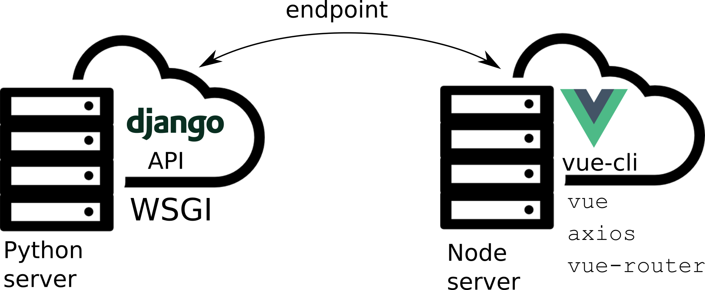
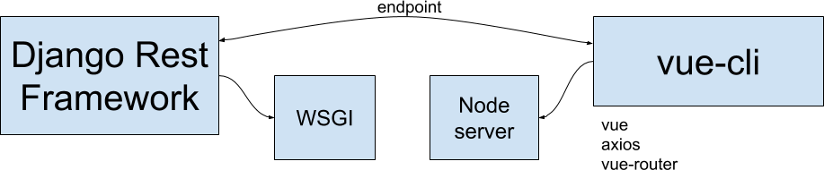

# django-vuejs-experience

Este projeto é uma experiência com [Django][5] e [VueJS][6].

Este projeto está divido em 4 repositórios:

# [django-vuejs-01-vue-inner-django][1]

Neste projeto eu uso **Django** e sua renderização tradicional de templates, e uso o **VueJS** apenas como um arquivo estático via CDN. Inclui também axios via CDN.

# [django-vuejs-02-vue-cli-static][2]

Aqui eu ainda uso o **Django** com sua renderização de templates. E o **VueJS** instalado com vue-cli.

Mas no final eu rodo o comando `npm run build` jogando os arquivos para a pasta `static` do Django.

# [django-vuejs-03-separated][3]

Neste projeto temos o **Django** totalmente separado do **VueJS**. Cada um rodando numa porta diferente. E a comunicação entre eles é feita pelos endpoints.

Inclui [vue][6], [axios][7] e [vue-routers][8].

# [django-vuejs-04-drf-vuejs][4]

Projeto feito com [Django Rest Framework][9] e [VueJS][6].

### Projetos antigos

Este projeto é baseado em:

* [django-vue-archived][10]
* [crm-django-vuejs-archived][11]
* [django-vuex-coreui-free-vue-admin-template][12]

Links:

[Django][5]

[VueJS][6]

[axios][7]

[vue-routers][8]

[Django Rest Framework][9]

[contrib gist][13]

[1]: https://github.com/rg3915/django-vuejs-01-vue-inner-django
[2]: https://github.com/rg3915/django-vuejs-02-vue-cli-static
[3]: https://github.com/rg3915/django-vuejs-03-separated
[4]: https://github.com/rg3915/django-vuejs-04-drf-vuejs
[5]: https://www.djangoproject.com/
[6]: https://vuejs.org/
[7]: https://github.com/axios/axios
[8]: https://router.vuejs.org/
[9]: https://www.django-rest-framework.org/
[10]: https://github.com/rg3915/django-vue-archived
[11]: https://github.com/rg3915/crm-django-vuejs-archived
[12]: https://github.com/rg3915/django-vuex-coreui-free-vue-admin-template
[13]: https://gist.github.com/rg3915/6fad3d19f2b511ec5da40cef5a168ca5
